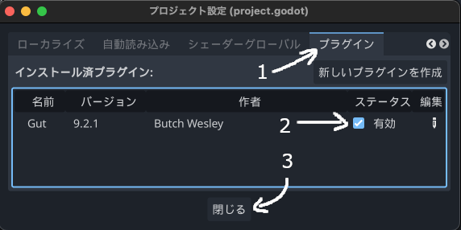

# 【Godot】場面切り替えサンプル

こちらの本の内容を反映させた、起動と、場面切り替え処理のサンプルのGodotプロジェクトです。

<a href="https://techbookfest.org/organization/bgzSCidTdQc0gKCVvM3Ghe">
Godot Engine研究ノート
</a>

## バージョン情報

- Godot 4.2.2

## 準備手順

Godotで開いて、動作をテストする手順です。

- 本リポジトリーをクローンするか、CodeからDownload ZIPなどでダウンロードして、任意の場所に展開します
- Godotで、入手したフォルダーをインポートして開きます
- AssetLibを開きます

- 検索欄にgutと入力して、GUT-Godot Unit Testing(Godot 4)をクリックします
- ダウンロードして、インストールします
- プロジェクトメニューから、プロジェクト設定を開きます
- プラグインタブを選択します

- Gutのステータスを有効にして、プロジェクト設定を閉じます

以上で、準備完了です。続けて、動作テストを実行します。

- エディター下部からGUTタブを開きます

- 読み込みボタンをクリックして、am1 > change_scene > testsフォルダーを開いて、test_settingsファイルをダブルクリックして読み込みます

以上で、テストの設定が完了しました。Run Allをクリックすると、自動的に機能のテストが一通り実行されます。成功したら、すべてPassになります。

起動すれば、手動でも試せます。各シーンで、ボタンをクリックして操作してください。

## 機能

本サンプルは、次のような機能を実装したものです。

- オリジナルのスプラッシュ画像を表示して起動
- 前回のプレイの続きから、自動的に再開する機能
- クリックして消したGodotアイコンを保存する機能
- 場面切り替えを統括するシーンSceneChanger
  - 自動読み込みに設定
  - 画面を隠すシーンを受け取って、管理
- 画面を隠すシーンFadeScene
  - 一瞬で隠すアニメ
  - 指定の秒数で隠す
  - 隠し終えたら、シグナルを発行
  - 指定の秒数で覆いを外すアニメ
  - 多いが外れたら、シグナルを発行
- 読み込むシーンのデータ
  - あればそのまま利用するUIシーンと、読み直すステージシーンを想定
  - 読み込むシーンのデータは、リソースで用意
- 解放するシーンは自動判定

## デモ内容

- Bootシーン(am1/change_scene/demo/scenes/boot.tscn)をメインシーンに設定。このシーンから起動します
- ボタンでゲーム開始します
- リトライ時に、ゲームのUIを再読み込みしないようにします
- ステージ
  - Godotアイコンをクリックすると、消せます
  - リトライボタンで、Godotアイコンが復活します
  - タイトルボタンで、タイトルへ戻ります
  - タイトルに戻さずに終了させると、次回の起動では、ゲームシーンから始まり、前回消していたGodotアイコンが消えた状態で再開します

## 主なファイル構成

### シーン
- am1/change_scene
  - demo デモ用のフォルダー
    - scenes
      - boot.tscn
        - 起動シーン。メインシーンに設定します
      - splash_screen.tscn
        - スプラッシュ画像で画面を覆うためのシーンです
        - このシーンの画像を変えれば、スプラッシュ画面を自由に変更できます
      - title.tscn
        - タイトルシーンです
      - game_ui.tscn
        - ゲーム中のリトライとタイトルへボタンを提供するシーンです
      - stage.tscn
        - Godotアイコンを配置したステージを想定したシーンです
      - clickable.tscn
        - Godotアイコンのシーンです
  - scenes
    - cover_fade.tscn
      - 画面をフェードで隠すためのシーンです

### スクリプト

- am1/change_scene
  - scripts
    - general_screen_cover.gd
      - 画面を覆うシーンにアタッチするスクリプトです。SceneChangerクラスを使った場面切り替え時に利用します
    - load_scene_array.gd
      - 場面を構成するシーンのデータを設定するための配列のリソースです
    - load_scene_data.gd
      - 場面を構成するシーンのデータです
    - scene_chagner.gd
      - 場面切り替えを統括するスクリプトです。自動読み込みに設定します
    - screen_cover_base.gd
      - 画面を覆う処理のベースクラスです。general_screen_cover.gdは、このクラスを継承しています
  - demo/scripts
    - boot.gd
      - 起動シーン用のスクリプトです。保存されている前回のシーンを読み出して、タイトルか、ゲームのどちらを呼び出すかを決めて、切り替えます。切り替え時に、スプラッシュ画像で画面を覆います
    - clickable.gd
      - Godotアイコンの制御スクリプトです。クリックしたら、ユーザー設定に保存をして、オブジェクトを消します
    - game_ui.gd
      - ゲームUIシーンを制御するスクリプトです。ゲームの開始や、リトライ、タイトルへ戻す処理を実装しています
    - stage.gd
      - ステージを管理するスクリプトです。保存されているデータに基づいて、起動時に不要なGodotアイコンを消します
    - title.gd
      - タイトルシーンを制御するスクリプトです
    - user_settings.gd
      - 最後に起動されていたシーンや、消したGodotアイコンを保存したり、読み出したりして、情報を提供するクラスです。自動読み込みに設定されています
  

<!--

## ドキュメント

- [シーン切り替え](docs/change-scene.md)
- [起動](docs/boot.md)

-->

## 使用アセット

- Splashスクリーンの画像
  - [KenneyNL. Godot SplashScreens](https://github.com/KenneyNL/Godot-SplashScreens)
    - Screen/Reimagined logo/your-logo-here-dark.png を使用しました
